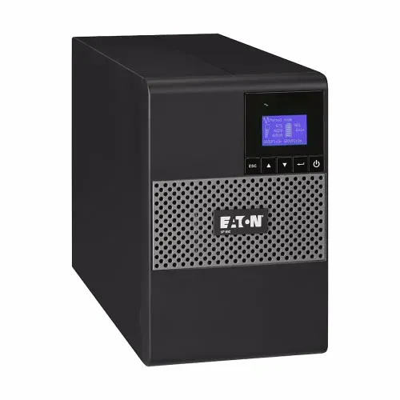

# Informe tècnic: Selecció d'un SAI per TecnoGestió S.L.

**Autor:** Oscar Fernandez  
**Departament:** SMX2  

---

## 1. Inventari d'equips

| Dispositiu              | Quantitat | Consum (W) | Comentaris                             |
|-------------------------|-----------|------------|----------------------------------------|
| Ordinador de sobretaula | 4         | 250 W      | Inclou monitor de 22” (~50 W)          |
| Impressora multifunció  | 1         | 30 W       | Només si cal guardar treballs crítics  |
| Router Wi-Fi            | 1         | 15 W       | Ha de romandre actiu                    |

**Potència total estimada:** 1045 W → amb reserva 20%: 1254 W → ≈ 1568 VA  
**Conclusió:** SAI mínim **1600 VA / 1250 W**

---

## 2. Autonomia requerida

- Temps mínim: 10 minuts  
- Objectiu: desar treballs i apagar equips correctament  

---

## 3. Models considerats

| Model                         | Potència (W) | Autonomia (min) | Sortides | Preu (€) |
|-------------------------------|--------------|----------------|----------|-----------|
| APC Back-UPS Pro 1500VA       | 865          | 10             | 10       | 250       |
| Eaton 5P 1550VA               | 1100         | 12–15          | 8        | 400       |
| CyberPower CP1500EPFCLCD      | 900          | 8–10           | 12       | 220       |

---

## 4. Comparació i selecció final

- **Selecció:** **Eaton 5P 1550VA**  
- **Justificació:** Combina **potència suficient**, **autonomia adequada** i **fiabilitat professional**.  

